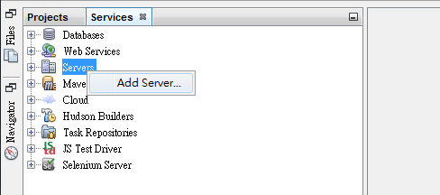
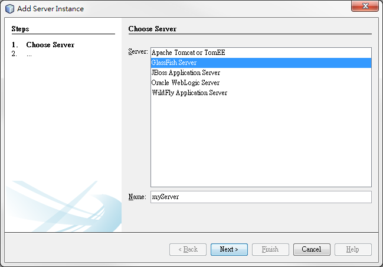
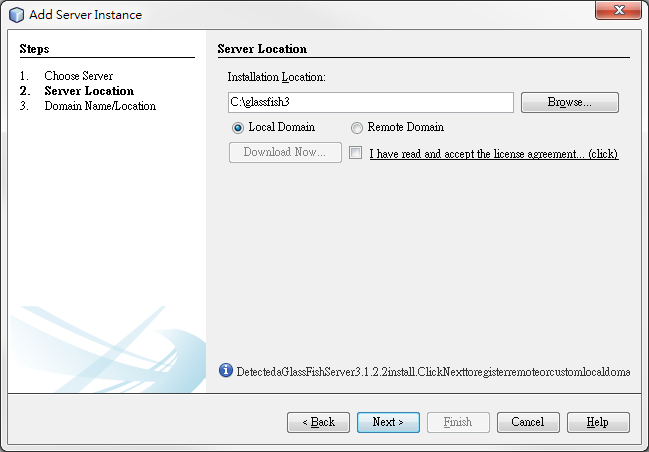
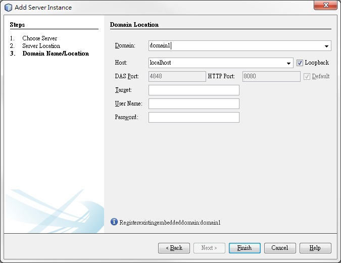
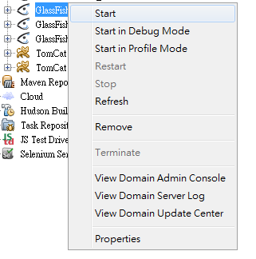
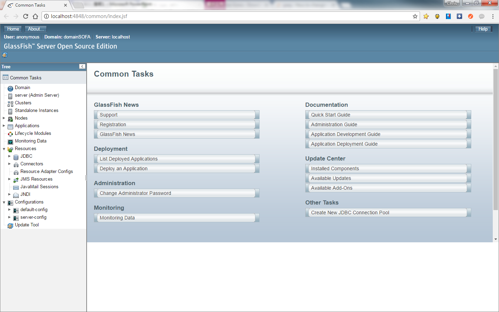
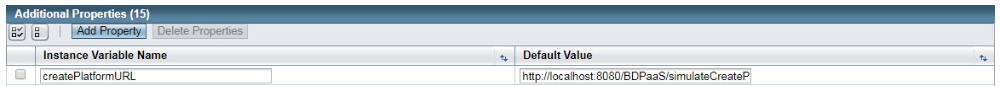
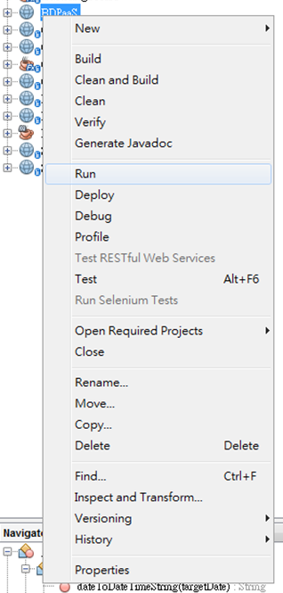
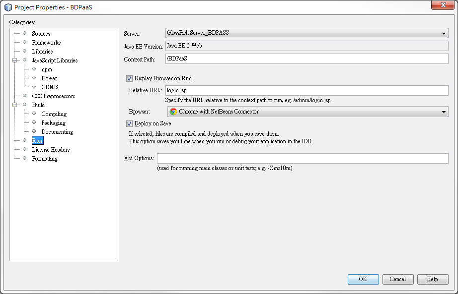

# BDPaaS UI

## Description

BDPaaS UI is an HTML5 web application written in javascript.

## Requirement

- JAVA: `Java 7` or `Java 8`.
- Web Server: `Glassfish 3.2`, `Glassfish 4.1` or `Tomcat`.
- IDE: `Netbeans 7` or higher.

## Installation

Following installation guide is based on glassfish and netbeans.

1. Download and install Java JDK & JRE.
2. Download and install gloassfish (optional), or use other web server.
3. Download and install netbeans (optional), or use other IDE.
4. Import project into netbeans
5. Add glassfish web server:
	5-1 Go to `Services`, right click `Server` and add a new server.
     
    
    5-2 Add a glassfish server and give server name.
     
    
    5-3 Assign the location where glassfish installed. Also you can set local domain or remote domain.
     
    
    5-4 Fill other information.
     
    
6. Once glassfish server is created. You can right-click the created item and start the server.
	 
    
7. The default glassfish console port is `4848`, to access glassfish web console, please go to http://< Glassfish_Host >:4848
	 
    
8. There are two soruces to get agentless performance data, you can setup source location in system properties of glassfish. To setup these properties by glassfish web console, goto `Configurations` -> `server-config` -> `System Properties`, and add `createPlatformURL`.
	 
    
9. To run BDPaaS UI, please go back to netbeans, right-click BDPaaS UI project and selected `properties`.
	 
    
10. Click `Run` item, and setup server as the glassfish server we created.
	 
    

## Documentation

## Used addons
- JQuery
- dateTimePicker
- perfectScrollbar
- moment
- Icons8 

## Acknowledgments

